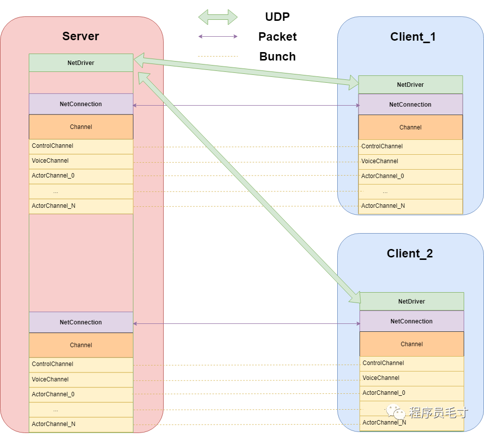
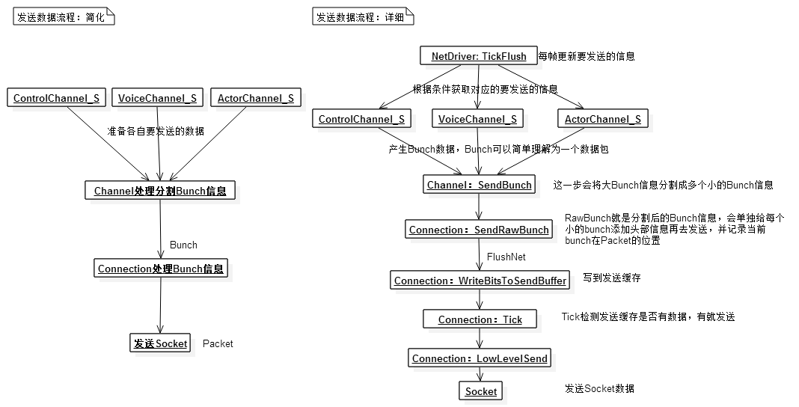
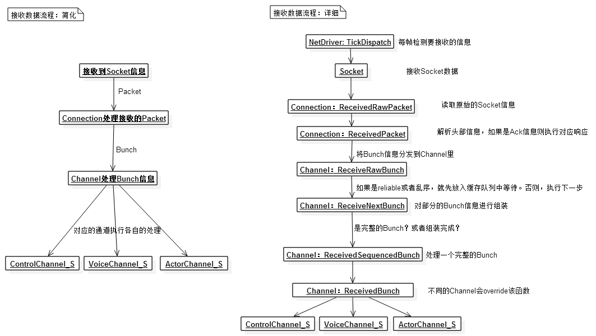
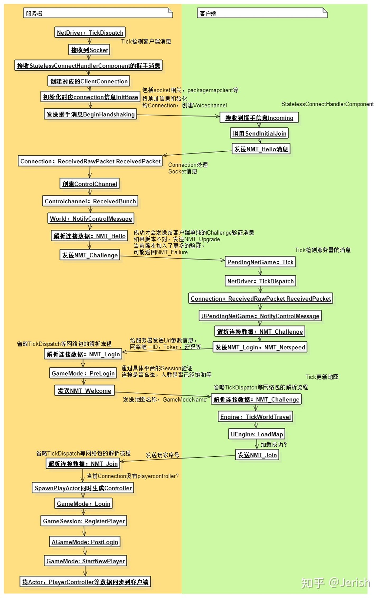
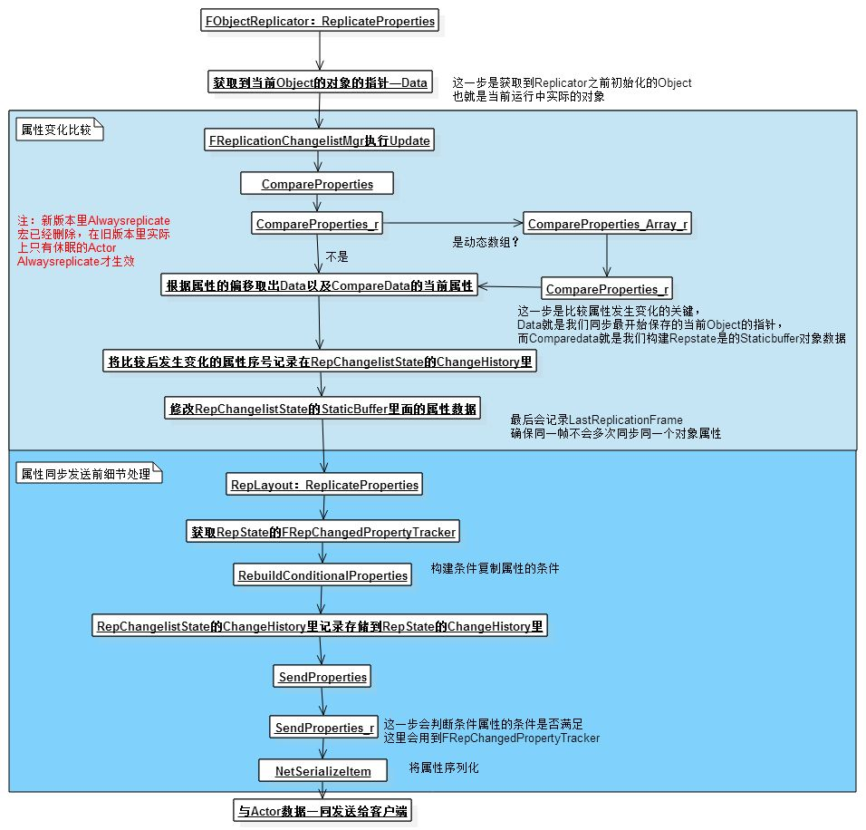
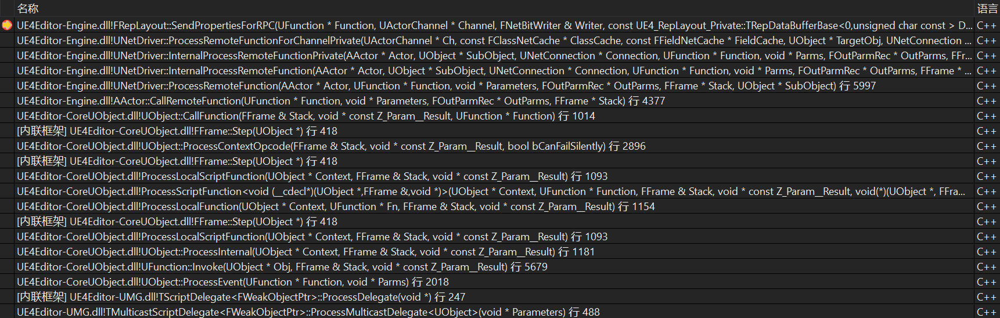

# UnrealNetwork

## NetDriver

虚幻的网络控制主要是三个类管理的。

其中NetDriver是网络收发包的起点。

大循环(FEngineLoop::Tick -> UWorld::Tick)调用TickFlush，更新要发送的数据。不同Channel的数据写入同一个Connection的缓存，在ConnectionTick中被发送出去。

大循环调用TickDispatch，reassemble 数据包，然后把包分发到对应的Channel。

上面两个大循环在DS和客户端都执行，运行于GameThread。

关键函数节点

- SendBunch 发送数据包
- SendRawBunch 发送分割的数据包
- ReceiveRawBunch 接受分割的数据包
- ReceiveBunch 接受数据包

## NetConnection

每个客户端和DS间有唯一的一条数据传输通道，用于数据的发送与响应(ack)等，对reliable的包实现了稳定传输。

## Channel

Control Channel 是控制信息的传输通道，用于连接建立，网速测速等。

DataChannel.h 中描述了详细的流程。

与游戏逻辑联系比较紧密的是ActorChannel，就像一个tcp连接中的通信双方，不管是值复制还是RPC，都是通过ActorChannel发送数据包，然后在对端的Actor执行赋值和Notify函数等。

## Replication

值复制由DS发起，NetDriver::TickFlush -> NetDriver::ServerReplicateActors -> NetDriver::ServerReplicateActors_ProcessPrioritizedActors -> Channel::ReplicateActor -> FObjectReplicator::ReplicateProperties。

0. ServerReplicateActors主循环遍历每个正在活动的Connection。
1. 首先需要确定哪些Actor需要被同步，函数在ServerReplicateActors_BuildConsiderList，引擎通过索引NetworkObjectList执行这一步，并执行一系列的校验，包括RemoteRole，UpdateFrequency，
2. 然后，我们会按照一定优先级同步各个Actor，具体代码在ServerReplicateActors_PrioritizeActors。遍历上一步获得的ConsiderList，这里会额外判断一些条件；如果无Channel，且Actor未加载或不相关，则跳过，如果`bOnlyRelevantToOwner`，只同步给Owner的客户端；判断Actor处于休眠(IsActorDormant)则跳过。最后排序，输出带优先级的Actor列表。
3. 然后进入同步阶段，调用ServerReplicateActors_ProcessPrioritizedActors。这里判断如果Channel为空，则重新创建一个。
4. 终于调用到了复制属性的逻辑Channel->ReplicateActor()。有关属性复制的代码在ActorReplicator->ReplicateProperties。

具体如何实现属性的diff，上面的流程图说的比较清楚。关键步骤在UpdateChangelistMgr，它通过CompareProperties，把当前要比较的UObject和RepChangelistState->StaticBuffer.GetData()进行diff，StaticBuffer是一个UObject的Shadow，初始化后，仅在每次这里Update时更新；其真正执行比较的两个函数是CompareProperties_r和CompareProperties_Array_r，这两个函数递归执行。

客户端收到同步包后执行回调的执行流程，只需要在OnRep中断个点就能看到了。TickDispatch大循环在ProcessBunch中调用RepLayout->CallRepNotifies，找到对应的回调函数UFunction并执行。

## RPC

虚幻RPC不返回，只有单向调用，因此返回值必须声明为void。

- AActor::CallRemoteFunction

主动调用RPC会走到反射代码里，反射代码通过ProcessEvent进入CallRemoteFunction，发送RPC包，包括参数和函数名。

ProcessEvent这个地方已经拿得到被调用函数的UFunction了，然后RPC函数的参数被保存在UFunction的基类Ustruct的属性链表PropertyLink里面(SendPropertiesForRPC)，然后以UObject的形式，序列化，发送到对端。注意这里发包是通过一个FNetBitWriter，向着对应的ActorChannel主动发送的，不走TickFlush的逻辑。

- FObjectReplicator::ReceivedRPC

在RPC_Impl中断点可以看到，接收端收到包后，在ProcessBunch中进入ReceivedRPC，读出函数名和参数，找到Impl后缀的RPC函数具体实现并执行。

## UObject的复制

`UObject*`同样可以成为属性，如一个`AActor*`，服务器会序列化它并发送，还会附带一个NetworkGUID用于DS和客户端统一的唯一标识；客户端接收到后，如果Actor尚不存在，则会先SpawnActor，再注册这个NetworkGUID与此Actor。相关代码在UPackageMapClient::SerializeNewActor处。然后，后续此子Actor的复制都会正常进行。

除了直接以Replicated修饰`UObject*`，其他直接从数据包中加载的Actor，Component也可以按照上面的过程分配NetworkGUID，走网络复制。

## 潜在优化点分析

- 找不出来，能做的burgess已经都做了QAQ。

## 重点

- 业务Send是bunch级的，面向channel，可能拆包为raw bunch
- channel为unacked的raw bunch维护重传链表outrec
- channel把raw bunch写conn的缓存，等待flushnet的发送
- 缓冲区满，conn tick，以及其他各种异常都会flushnet
- flushnet发送的是packet，包括多个raw bunch
- ack是面向packet的，ack到达对端时，把对应的raw bunch从各个ch的outrec中删除
- ack不连续才会重传，超时不重传而是直接close
- 接受方维护一个AckSeq，每帧Receive时，InPacketId如果比AckSeq+1大，则它们之间间隔的Packet一律视为丢包，接收方会把相对应的ack和nak发回去；然后，AckSeq=InPacketId，后续即使再次接受到这些nak的包，也不会处理；接收方会等待对端处理nak触发重传，递增PacketId，发送的新的重传Packet；
- Channel也有序列号ChSequence，ReceivedRawBunch时，如果ChSequence不连续则会把Raw Bunch缓存在InRec链表；这样Possess总是按序读raw bunch，也就规避了复制和rpc的时序问题，也能正确合并分包的raw bunch
- 存在合包优化，同actor channel多个包可以共享header
- QueuedBits用于实现流量控制，每个conn tick，根据预配置的maxnetspeed，让QueuedBits减少deltatime × maxnetspeed，flushnet让QueuedBits增加，QueuedBits过大则逻辑层无法发包；