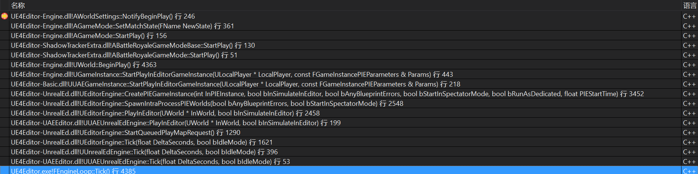
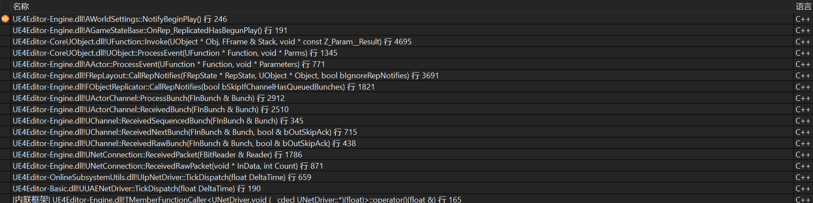

# Actor生命周期

https://zhuanlan.zhihu.com/p/308217207

## 引擎的Main函数

位于Launch.cpp的GuardedMain函数，进入FEngineLoop::Tick大循环无限执行。

## Beginplay

两种主要方式，一种是从地图加载的，一种是SpawnActor；网络复制的Actor，初次出现在客户端时也会Spawn。

BeginPlay前还会执行一系列初始化操作

1. PostLoad/PostActorCreated - Do any setup of the actor required for construction. PostLoad for serialized actors, PostActorCreated for spawned.
2. AActor::OnConstruction - The construction of the actor, this is where Blueprint actors have their components created and blueprint variables are initialized
3. AActor::PreInitializeComponents - Called before InitializeComponent is called on the actor’s components
4. UActorComponent::InitializeComponent - Each component in the actor’s components array gets an initialize call (if bWantsInitializeComponent is true for that component)
5. AActor::PostInitializeComponents - Called after the actor’s components have been initialized
6. AActor::BeginPlay - Called when the level is started

对地图加载的Actor，在DS，Beginplay是GameMode派发的，在客户端，Beginplay是GameState派发的。

对SpawnActor，则是函数本身派发的。在SpawnActor返回之前，Beginplay已经被调用。

## Tick

Actor::Beginplay中注册Tick，World::Tick调度与派发Actor::Tick。

## Endplay

Actor创建后会被注册在对象池内，对象池减小了对象构造和销毁的开销，还通过Tick实现了Actor定时销毁机制。

在显式调用Destroy，定时销毁，关卡切换、游戏结束时，Actor会被销毁，这个销毁会给Actor打一个标签，调用Endplay；下次GC时，回收此Actor。

