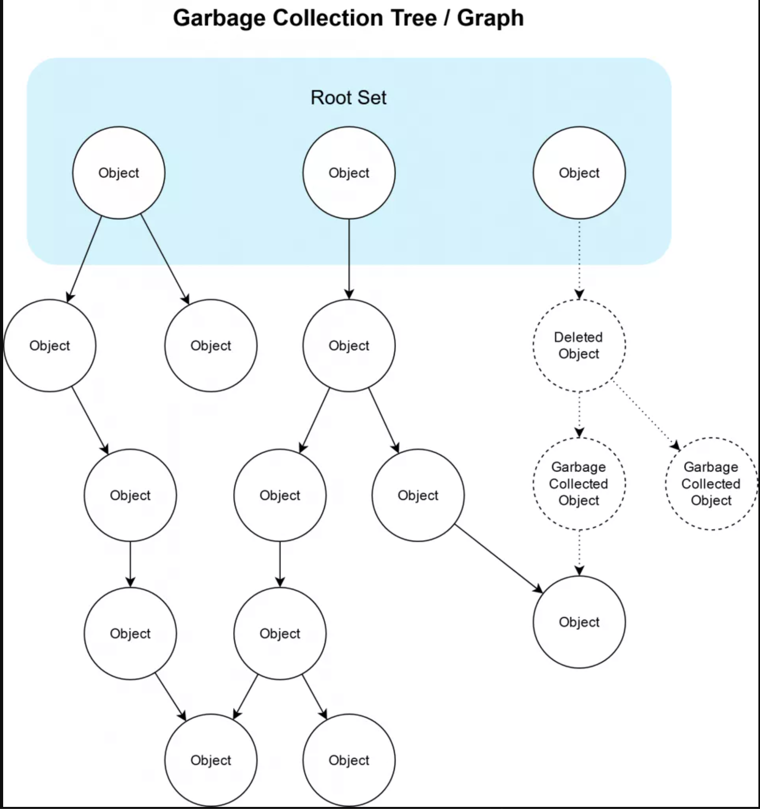
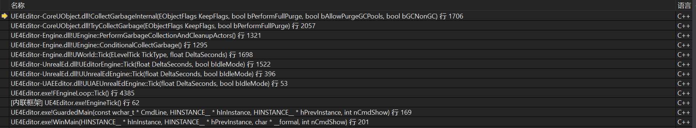
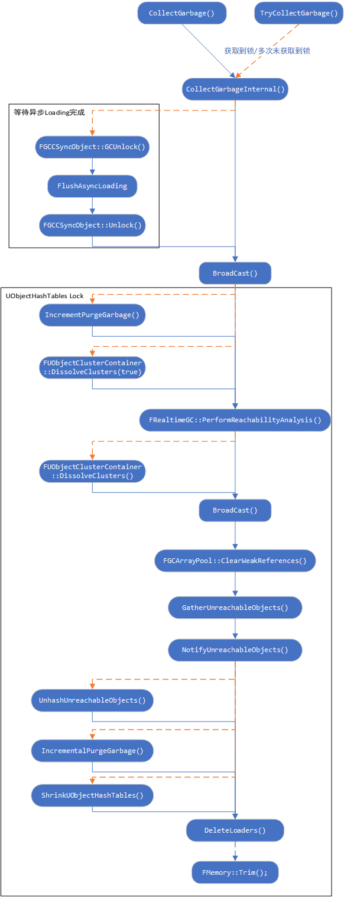

# Garbage Collection

## 基本原理

虚幻的垃圾回收使用标记清除算法，即周期性地扫描所有对象，找到不被引用的对象，删除它们。只有UObject才参与GC。

GC的扫描起点是根对象列表，从这些对象开始的，引用有向图可达的对象都是有引用的对象，不会被GC。引用边的建立可以是虚幻的UPROPERTY、智能指针，单纯的裸指针是不生效的。所以记得在裸指针和指针的容器前加一个UPROPERTY。



AddToRoot()把对象加入到根对象数组，不会GC。

放置在场景中的Actor被Level引用，只要Level在就不会被GC。

SpawnActor创建的Actor，如果不被存储下来，也一样会被GC。DestroyActor不直接删除Actor，而是打一个标记(PendingKill)，在下次GC时回收掉它。

因此，如果你不确定一个对象是不是有效，只是判空是不可靠的，使用IsValid接口可以判断是否被GC。

```cpp
FORCEINLINE bool IsValid(const UObject *Test)
{
	return Test && !Test->IsPendingKill();
}
```

GC可以手动调用。

```cpp
GWorld->GetWorld()->ForceGarbageCollection(true);
```

## Mark

入口`CollectGarbageInternal`

游戏内的周期GC被WorldTick驱动，打个断点可以看到堆栈。



GC是和游戏逻辑交替进行的，而不是单独存在一个GC线程，所以不存在我在游戏逻辑里用一个Object，用着用着它突然空掉了的情况。但使用上面的IsValid是有必要的，如果强行使用一个PendingKill的Actor，这是未定义行为，程序逻辑是无法预期的。

相对的，在GameThread以外的线程创建和销毁Object，如SpawnActor是不被允许的。在其他线程操作Object，也会涉及到全局变量的访问，需要加GC锁(FGCScopeGuard ScopeGuard())，阻塞掉GC函数。

这里的TryCollectGarbage是CollectGarbage的松弛版，只会尝试性获得锁，如果获取不到，就暂时跳过，直到积累了一定尝试次数才强行等待锁。

CollectGarbageInternal的执行流程如图所示



这个函数主要做了两件事，一个是可达性分析PerformReachabilityAnalysis，一个是不可达对象收集，这就是Mark的工作了。

## Sweep

入口`IncrementalPurgeGarbage`

UnhashUnreachableObjects() ，该函数内会调用每个UObject对象的 ConditionalBeginDestroy() 函数，最终会调用到 BeginDestroy() 函数；

IncrementalDestroyGarbage() ，该函数内部会调用每个UObject对象的 ConditionalFinishDestroy() 函数，最终会调用到 FinishDestroy() 函数;

然后显式调用析构函数，Free，对象被彻底移除。
