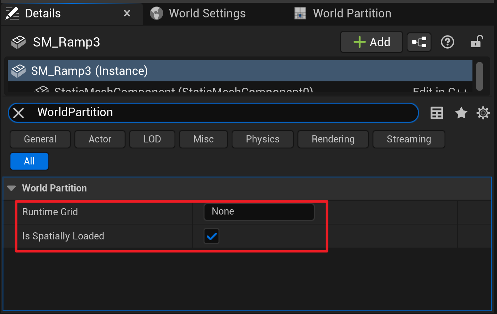
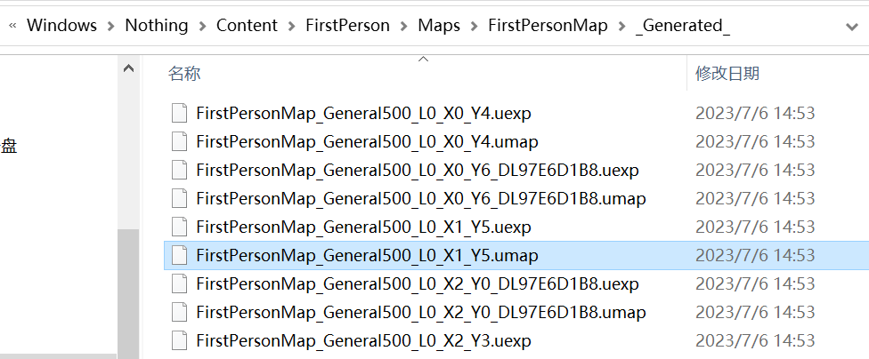

# WorldPartition

<!-- TOC -->

- [WorldPartition](#worldpartition)
  - [Introduction](#introduction)
  - [Environment](#environment)
  - [Usage](#usage)
    - [Setup](#setup)
      - [Project\&Map](#projectmap)
      - [WorldSettings](#worldsettings)
      - [ActorDetails](#actordetails)
      - [WorldPartitionEditor](#worldpartitioneditor)
    - [Debug](#debug)
      - [PreviewGrids](#previewgrids)
      - [Console](#console)
      - [Logs](#logs)
    - [Data Layer](#data-layer)
      - [DataLayerAsset](#datalayerasset)
      - [DataLayersOutliner](#datalayersoutliner)
      - [ActorDetails](#actordetails-1)
      - [Console](#console-1)
      - [Coding](#coding)
  - [CodeAnalyze](#codeanalyze)
    - [Generation](#generation)
      - [PreparationPhase](#preparationphase)
        - [Classes](#classes)
        - [StreamingGenerationContext](#streaminggenerationcontext)
        - [GenerateObjectsClusters](#generateobjectsclusters)
      - [GenerateStreaming](#generatestreaming)
        - [Classes](#classes-1)
        - [GetPartitionedActors](#getpartitionedactors)
        - [CreateStreamingGrid](#createstreaminggrid)
    - [Storage](#storage)
      - [OFPA](#ofpa)
      - [Cook](#cook)
      - [Runtime](#runtime)
    - [Streaming](#streaming)
      - [StreamingSourceProvider](#streamingsourceprovider)
      - [UpdateStreamingState](#updatestreamingstate)
      - [LevelStreaming](#levelstreaming)
  - [Summary](#summary)

<!-- /TOC -->

## Introduction

UE5引擎中，Epic新增了全新的无缝大世界管理系统WorldPartition，用于替代旧的WorldComposition系统；在这篇文章里，我会介绍WorldPartition的基本使用，并分析其关键源码，尝试把此系统的设计理念和优缺点介绍给大家；

根据[官方文档](https://docs.unrealengine.com/5.0/zh-CN/world-partition-in-unreal-engine/)，WorldPartition相对于WorldComposition，主要解决了两个痛点；

- 子关卡划分

  启用WorldPartition后，所有Actor都可以放在主关卡(PersistentLevel)内，引擎会自动帮你把整个关卡切分成固定间距的格子(Cell)，每个Cell自成一个子关卡，从而不再需要手动分割；

- 文件抢占

  关卡内的每个Actor都分离为单独的文件来存储(One Actor Per File)，关卡编辑以Actor为粒度进行Checkout，从而大大减小了多人编辑时面临的冲突；

关卡切分的最小格子间距(CellSize)和格子的触发距离(LoadingRange)是用户自定义的；当流加载源(StreamingSource)为中心的，半径为LoadingRange的球形区域和Cell重合时，就会激活Cell的加载；


用户自定义的(CellSize,LoadingRange)，定义了一种关卡切分策略，虚幻称之为网格(Grid)；

Grid下Cell的实际大小，可能是CellSize，也可能是其2的指数幂$(CellSize \times 2^n)$；例如，我们指定CellSize=$400$，WorldBounds=$3000 \times 3000$，则Cell的实际大小可能是400，800，1600，3200；这样，我们就有多个级别大小的Cell，对于任意大小的Actor，我们都能找到能够完全包围它的Cell，并把它分配到这个Cell内；

虚幻称指数n为网格等级(GridLevel)；这样，对于每个Cell，其位置和尺寸便可由CellSize，GridLevel，X，Y唯一定义；


虚幻允许用户定义多套Grids，也就是多套CellSize和LoadingRange，你可以显式地把Actor指派到某个Grid内；

这提供了较好的灵活性。例如，你可能会希望某些Actor能够在更远的距离被看到，这时你可以把它们放入独立的Grid，并修改加载距离；


WorldPartition保留了WorldComposition中层(Layer)的概念，你可以使用DataLayer来聚类管理地图中不同类别的Actor；每个Actor可以被分配到一个或多个层，当其所属层被激活时，触发Actor的加载；

## Environment

笔者的环境基于UE 5.2.1源码本地构建；

## Usage

这一小节介绍WorldPartition的基本使用；

### Setup

#### Project&Map

首先我们启动虚幻编辑器，创建一个新项目，本次演示，我选择的项目为`First Person`第一人称射击模板；


然后打开工程，并选择一张地图；这里可以编辑已有的地图，也可以创建一张新的地图，比如使用`OpenWorld`开放世界模板建立新地图；


本次演示，我使用的地图为工程提供的默认地图`FirstPersonMap`，此地图已经默认开启了WorldPartition特性；

#### WorldSettings

打开地图后，我们需要在世界设置(WorldSettings)面板勾选EnableStreaming选项，然后配置下方的Grids数组；Grids里面至少需要配置一个Grid，并根据实际的使用需要编辑其CellSize和LoadingRange；


#### ActorDetails

对于需要走WorldPartition的Actor，我们需要在Details面板勾选其IsSpatiallyLoaded属性；在使用多套Grids的情景下，我们还可以修改RuntimeGrid属性，来人为决定Actor走哪一套Grid；



#### WorldPartitionEditor

勾选了IsSpatiallyLoaded的Actor，在预览视口中默认不加载；为了让它们可见，我们需要打开WorldPartitionEditor；


在WorldPartitionEditor中，框选你希望预览的区域，然后右键，点击Load Region From Selection；


### Debug

UE5内置了很多WorldPartition的调试工具，你可以使用它们方便地观察并分析网格划分状态，Actor分配状态，流加载状态，流加载性能等；

#### PreviewGrids

勾选WorldSettings中的PreviewGrids，可以在预览视口内观察Cells划分，并以预览相机为StreamingSource高亮被激活的Cell；


#### Console

在运行时通过Console输入`wp.Runtime.ToggleDrawRuntimeHash2D`，即可在左上角实时绘制当前的Grid运行时状态；


除此之外，还有其他控制台命令可用于绘制更多细节；

`wp.Runtime.ToggleDrawRuntimeHash3D` 绘制3D Grid
`wp.Runtime.ShowRuntimeSpatialHashGridLevel n` 指定要绘制的GridLevel
`wp.Runtime.ShowRuntimeSpatialHashGridLevelCount n` 同时绘制n个GridLevel

#### Logs

WorldPartition会输出独立的Log文件到指定的文件夹，开发者可以分析日志来定位bug；


### Data Layer

UE5使用DataLayer代替UE4的Layer，你可以把Actor划分到不同的DataLayer来聚类管理它们；

#### DataLayerAsset

UE 5.2.1中，DataLayer以DataLayerAsset的形式配置属性并存盘，因此在地图中添加DataLayer之前，我们需要先创建一个DataLayerAsset；

在内容浏览器中右键，找到Miscellaneous中的DataLayerAsset，创建；


打开刚创建的DataLayerAsset，编辑其DataLayerType为Runtime(让其在运行时生效)；


#### DataLayersOutliner

现在我们添加一个DataLayer到地图里，打开DataLayersOutliner窗口；


把创建好的DataLayerAsset拖放到窗口内即可；


点击创建好的DataLayer，细节面板有一些可供编辑的属性，可根据实际需要调整；

- IsInitiallyVisible，是否在编辑器内默认可见
- IsInitiallyLoaded，是否在编辑器内默认加载
- InitialRuntimeState，运行时默认加载状态

点击小眼睛来在编辑器内显示/隐藏某个DataLayer，点击勾选框来在编辑器内加载/卸载某个DataLayer；


#### ActorDetails

通过选中Actor并编辑其DataLayerAssets，来把Actor分配到一个或多个DataLayer；


#### Console

在运行时通过Console输入`wp.Runtime.ToggleDataLayerActivation DataLayerName`，即可实时加载或卸载指定的DataLayer；


#### Coding

虚幻也提供了一系列接口，用于设置DataLayer的状态；


## CodeAnalyze

### Generation

在编辑器环境下，每次PIE开始时都会根据当前的关卡内容和Grids配置，实时生成Cell并划分Actor；而在打包环境下，这些划分结果会和WorldPartition一起被序列化，并在运行时直接读取，我们首先就来分析一下生成与划分的逻辑；

主要逻辑的函数入口位于`UWorldPartition::GenerateContainerStreaming`，其内部的调用关系如图所示；


#### PreparationPhase

##### Classes

代码涉及到了几个新的类定义，包括ActorDesc，ActorDescView，Container，ContainerDescriptor，ContainerInstance等。下面让我们一起看一下这些类的定义和作用；

`FWorldPartitionActorDesc`

```cpp
/**
 * Represents a potentially unloaded actor (editor-only)
 */
class ENGINE_API FWorldPartitionActorDesc
{
  // Persistent
  FGuid							Guid;
  FTopLevelAssetPath				BaseClass;
  FTopLevelAssetPath				NativeClass;
  FName							ActorPackage;
  FSoftObjectPath					ActorPath;
  FName							ActorLabel;
  FVector							BoundsLocation;
  FVector							BoundsExtent;
  FName							RuntimeGrid;
  bool							bIsSpatiallyLoaded;
  bool							bActorIsEditorOnly;
  bool							bActorIsRuntimeOnly;
  bool							bActorIsHLODRelevant;
  bool							bIsUsingDataLayerAsset; // Used to know if DataLayers array represents DataLayers Asset paths or the FNames of the deprecated version of Data Layers
  FName							HLODLayer;
  TArray<FName>					DataLayers;
  TArray<FGuid>					References;
  TArray<FName>					Tags;
  FPropertyPairsMap				Properties;
  FName							FolderPath;
  FGuid							FolderGuid;
  FGuid							ParentActor; // Used to validate settings against parent (to warn on layer/placement compatibility issues)
  FGuid							ContentBundleGuid;
  
  // Transient
  mutable uint32					SoftRefCount;
  mutable uint32					HardRefCount;
  UClass*							ActorNativeClass;
  mutable TWeakObjectPtr<AActor>	ActorPtr;
  UActorDescContainer*			Container;
  TArray<FName>					DataLayerInstanceNames;
  bool							bIsForcedNonSpatiallyLoaded;

  static TMap<TSubclassOf<AActor>, FActorDescDeprecator> Deprecators;
};
```

FWorldPartitionActorDesc包含了Actor指针，Container指针，Class指针，和各种Actor的描述数据；

我们可以通过运行时断点监视清楚地看到其内部数据；


`FWorldPartitionActorDescView`

```cpp
/**
 * A view on top of an actor desc, used to cache information that can be (potentially) different than the actor desc
 * itself due to streaming generation logic, etc.
 */
class ENGINE_API FWorldPartitionActorDescView
{
  ...
  const FWorldPartitionActorDesc* ActorDesc;
  bool bIsForcedNonSpatiallyLoaded;
  bool bIsForcedNoRuntimeGrid;
  bool bInvalidDataLayers;	
  TOptional<TArray<FName>> RuntimeDataLayers;
  TOptional<TArray<FGuid>> RuntimeReferences;
};
```

ActorDesc中的部分数据，运行时会有所不同，FWorldPartitionActorDescView承担的就是缓存这些运行时数据的任务(View这个命名，不看注释还真是不太好懂)；

例如，某些DataLayer不是Runtime的，则它会出现在ActorDesc.DataLayers里，但不会出现在ActorDescView.RuntimeDataLayers里；

`UActorDescContainer`

```cpp
UCLASS()
class ENGINE_API UActorDescContainer : public UObject, public FActorDescList
{
  ...
};

class ENGINE_API FActorDescList
{
  ...
  TChunkedArray<TUniquePtr<FWorldPartitionActorDesc>> ActorDescList;
  TMap<FGuid, TUniquePtr<FWorldPartitionActorDesc>*> ActorsByGuid;
  TMap<FName, TUniquePtr<FWorldPartitionActorDesc>*> ActorsByName;
};
```

UActorDescContainer是一个UObject和FActorDescList的多继承，FActorDescList则包含了一个FWorldPartitionActorDesc类型的数组，和两个索引；

`FContainerDescriptor`

```cpp
struct FContainerDescriptor
{
  ...
  const UActorDescContainer* Container;
  FActorDescViewMap ActorDescViewMap;
  FActorDescViewMap FilteredActorDescViewMap;
  TArray<FWorldPartitionActorDescView> ContainerInstanceViews;
  TArray<TArray<FGuid>> Clusters;
};
```

FContainerDescriptor包含了本Container的指针，SubContainers的ActorDescViews及其索引，以及Actor聚类Clusters；

UE 5.2.1中，只有[LevelInstanceActor](https://docs.unrealengine.com/5.0/en-US/level-instancing-in-unreal-engine/)才会成为SubContainer，我们本次示例暂不讨论这一高级特性；

`FContainerInstanceDescriptor`

```cpp
struct FContainerInstanceDescriptor
{
  ...
  FBox Bounds;
  FTransform Transform;
  const UActorDescContainer* Container;
  EContainerClusterMode ClusterMode;
  TSet<FName> RuntimeDataLayers;
  FName RuntimeGrid;
  bool bIsSpatiallyLoaded;
  FString OwnerName;
  FActorContainerID ID;
};
```

FContainerInstanceDescriptor和FContainerDescriptor类似，也持有本Container的指针，此外还包括了ID，Bounds，Transform，DataLayer等数据；

分离FContainerDescriptor和FContainerInstanceDescriptor两个结构体的目的是，方便对同一个Container创建多个ContainerInstance。UE 5.2.1中，暂时还没有为同一个Container创建多个ContainerInstance的场景，我们可以认为一个Container，与之对应的ContainerDescriptor和ContainerInstanceDescriptor都各有且仅有一个；

几个类之间的关系如图所示；


我们再来看StreamingGenerator类本身；

```cpp
class FWorldPartitionStreamingGenerator
{
  /** Maps containers to their container descriptor */
  TMap<const UActorDescContainer*, FContainerDescriptor> ContainerDescriptorsMap;
  
  /** Maps containers IDs to their container instance descriptor */
  TMap<FActorContainerID, FContainerInstanceDescriptor> ContainerInstanceDescriptorsMap;

  /** Maps containers IDs to their parent ID */
  TMap<FActorContainerID, FActorContainerID> ContainersHierarchy;

  /** Data required for streaming generation interface */
  TUniquePtr<FStreamingGenerationContext> StreamingGenerationContext;

  /** List of containers participating in this streaming generation step */
  TMap<FGuid, const UActorDescContainer*> ActorGuidsToContainerMap;
};
```

FWorldPartitionStreamingGenerator存储了Container和Descriptor的映射，以及Container的树形层级关系(如上文所述，本次示例用不到)；

StreamingGenerationContext如其注释所述，它存储必要的数据，并为后续的Generation过程所用；

理解了数据定义后，我们再回过头来看PreparationPhase的逻辑；

```cpp
void PreparationPhase(const UActorDescContainer* Container)
{
  CreateActorContainers(Container);

  // Construct the streaming generation context
  StreamingGenerationContext = MakeUnique<FStreamingGenerationContext>(this, Container);
}
```

在CreateActorContainers中，根据传入的Container，为Container构造ContainerDescriptor和ContainerInstanceDescriptor，并为Container内的Actor构造ActorDescView；

在FStreamingGenerationContext构造函数中，把构造好的数据导出为StreamingGenerationContext，为后续流程所用；

##### StreamingGenerationContext

StreamingGenerationContext内的结构体层次如下；

```cpp
struct ENGINE_API FActorSet
{
  TArray<FGuid> Actors;
};

struct ENGINE_API FActorSetContainer
{
  const FActorDescViewMap* ActorDescViewMap;
  const UActorDescContainer* ActorDescContainer;
  TArray<TUniquePtr<FActorSet>> ActorSets;
};

struct ENGINE_API FActorSetInstance
{
  FBox Bounds;
  FName RuntimeGrid;
  bool bIsSpatiallyLoaded;
  TArray<const UDataLayerInstance*> DataLayers;
  FGuid ContentBundleID;
  const FActorSetContainer* ContainerInstance;
  FActorContainerID ContainerID;
  FTransform Transform;
  const FActorSet* ActorSet;
};

class FStreamingGenerationContext : public IStreamingGenerationContext
{
  FBox WorldBounds;
  int32 MainWorldActorSetContainerIndex;
  TArray<FActorSetContainer> ActorSetContainers;
  TArray<FActorSetInstance> ActorSetInstances;
};
```


FActorSet是多个Actor构成的集合，FActorSetContainer是多个ActorSet构成的集合，而FStreamingGenerationContext.ActorSetContainers为每个PreparationPhase产出的Container创建一个ActorSetContainer；FStreamingGenerationContext.ActorSetInstances则是为每个ActorSet缓存一些重要数据；

那么问题来了，对同一个Container中的所有Actor，要怎么划分ActorSet呢？

##### GenerateObjectsClusters

划分Actor，或者说聚类Actor的核心逻辑，由一个静态函数GenerateObjectsClusters实现；

```cpp
TArray<TArray<FGuid>> GenerateObjectsClusters(TArray<TPair<FGuid, TArray<FGuid>>> InObjects)
{
  TMap<FGuid, FGuid> ObjectToClusters;
  TMap<FGuid, TSet<FGuid>> Clusters;

  for (const auto& Object : InObjects)
  {
    const FGuid& ObjectGuid = Object.Key;
    FGuid ClusterGuid = ObjectToClusters.FindRef(ObjectGuid);

    if (!ClusterGuid.IsValid())
    {
      ClusterGuid = FGuid::NewGuid();
      TSet<FGuid>& Cluster = Clusters.Add(ClusterGuid);
      ObjectToClusters.Add(ObjectGuid, ClusterGuid);
      Cluster.Add(ObjectGuid);
    }

    for (const FGuid& ReferenceGuid : Object.Value)
    {
      FGuid ReferenceClusterGuid = ObjectToClusters.FindRef(ReferenceGuid);

      if (ReferenceClusterGuid.IsValid())
      {
        if (ReferenceClusterGuid != ClusterGuid)
        {
          TSet<FGuid> ReferenceCluster = Clusters.FindAndRemoveChecked(ReferenceClusterGuid);
          TSet<FGuid>& Cluster = Clusters.FindChecked(ClusterGuid);
          Cluster.Append(ReferenceCluster);
          for (const FGuid& OtherReferenceGuid : ReferenceCluster)
          {
            ObjectToClusters.FindChecked(OtherReferenceGuid) = ClusterGuid;
          }
        }
      }
      else
      {
        TSet<FGuid>& Cluster = Clusters.FindChecked(ClusterGuid);
        Cluster.Add(ReferenceGuid);
      }

      ObjectToClusters.Add(ReferenceGuid, ClusterGuid);
    }
  }
  
  TArray<TArray<FGuid>> Result;
  Result.Reserve(Clusters.Num());

  for (const auto& Cluster : Clusters)
  {
    Result.AddDefaulted_GetRef() = Cluster.Value.Array();
  }

  return MoveTemp(Result);
}
```

其逻辑并不复杂，可以简化为如下的伪代码；

```
for each obj:
  if obj not in any clusters:
    create new cluster C
  for each obj2 to which obj refers:
    if obj2 is already in C2:
      if C != C2:
        merge C and C2
    else:
      add obj2 to C
  
return clusters
```

可以看出，函数把所有存在单向引用或双向引用的Actor放入同一个Cluster；

我们可以做一个简单的实验，把场景中的几个Actor，attach到某个Actor上；


点击运行，并观察日志，可以看到这几个Actor被聚类到了同一个Cluster中；


#### GenerateStreaming

PreparationPhase完成了基本的数据构造(Bounds, DataLayers等)与Actor聚类，在GenerateStreaming部分，将实际进行Cell的划分，并把每个ActorSet分配到合适的Cell内；

##### Classes

我们还是先看数据结构；

`UWorldPartitionRuntimeSpatialHash`

```cpp
UCLASS()
class ENGINE_API UWorldPartitionRuntimeSpatialHash : public UWorldPartitionRuntimeHash
{
#if WITH_EDITORONLY_DATA
  UPROPERTY(EditAnywhere, Config, Category = RuntimeSettings)
  TArray<FSpatialHashRuntimeGrid> Grids;

  /** Whether to preview runtime grids. */
  UPROPERTY(Transient)
  bool bPreviewGrids;

  UPROPERTY(Transient)
  mutable FWorldPartitionRuntimeSpatialHashGridPreviewer GridPreviewer;

  TMap<FString, UWorldPartitionRuntimeCell*> PackagesToGenerateForCook;
#endif

  /** 
   * Represents the streaming grids (PIE or Game)
   */
  UPROPERTY(NonPIEDuplicateTransient)
  TArray<FSpatialHashStreamingGrid> StreamingGrids;
  mutable TMap<FName, const FSpatialHashStreamingGrid*> NameToGridMapping;
  mutable bool bIsNameToGridMappingDirty;
};
```

Grids就是我们上文在编辑器中配置的属性。对每一个Grids中配置的Grid，运行时都会生成与之对应的FSpatialHashStreamingGrid，并放入StreamingGrids中；

`FSpatialHashStreamingGrid`

```cpp
/**
 * Represents a PIE/Game streaming grid
 */
USTRUCT()
struct ENGINE_API FSpatialHashStreamingGrid
{
  UPROPERTY()
  FName GridName;

  UPROPERTY()
  FVector Origin;

  UPROPERTY()
  int32 CellSize;

  UPROPERTY()
  float LoadingRange;

  UPROPERTY()
  bool bBlockOnSlowStreaming;

  UPROPERTY()
  FLinearColor DebugColor;

  UPROPERTY()
  TArray<FSpatialHashStreamingGridLevel> GridLevels;

  UPROPERTY()
  FBox WorldBounds;

  UPROPERTY()
  bool bClientOnlyVisible;

  UPROPERTY()
  TObjectPtr<const UHLODLayer> HLODLayer;
};
```

FSpatialHashStreamingGrid包括从Grid中传过来的CellSize和LoadingRange等静态信息，运行时动态生成的WorldBounds信息，和其包含的多个GridLevels；

`FSpatialHashStreamingGridLevel`

```cpp
/**
 * Represents a PIE/Game streaming grid level
 */
USTRUCT()
struct FSpatialHashStreamingGridLevel
{
  /** 
   * Represents the grid cells
   */
  UPROPERTY()
  TArray<FSpatialHashStreamingGridLayerCell> LayerCells;

  /** 
   * Represents the grid cells index mapping
   */
  UPROPERTY()
  TMap<int64, int32> LayerCellsMapping;
};
```

FSpatialHashStreamingGridLevel使用数组+索引的方式稀疏存储其下层的LayerCells。LayerCellsMapping的Key是X和Y的一维映射，Value则是LayerCells数组的下标。这样的实现可以不用为没有Actor的Cell创建LayerCell实体，进而节省了内存；

`FSpatialHashStreamingGridLayerCell`

```cpp
USTRUCT()
struct FSpatialHashStreamingGridLayerCell
{
  UPROPERTY()
  TArray<TObjectPtr<UWorldPartitionRuntimeCell>> GridCells;
};
```

FSpatialHashStreamingGridLayerCell持有多个UWorldPartitionRuntimeCell对象(考虑到DataLayers的不同)；

`UWorldPartitionRuntimeCell`

```cpp
/**
 * Represents a PIE/Game streaming cell which points to external actor/data chunk packages
 */
UCLASS(Abstract)
class ENGINE_API UWorldPartitionRuntimeCell : public UObject, public IWorldPartitionCell
{
  UPROPERTY()
  TArray<FName> DataLayers;

  // Debug Info
  UPROPERTY()
  FWorldPartitionRuntimeCellDebugInfo DebugInfo;

  // Custom Priority
  UPROPERTY()
  int32 Priority;

  UPROPERTY()
  bool bClientOnlyVisible;

  UPROPERTY()
  bool bIsHLOD;

  UPROPERTY()
  bool bBlockOnSlowLoading;

  UPROPERTY()
  FGuid ContentBundleID;

protected:
  UPROPERTY()
  FGuid CellGuid;

#if !UE_BUILD_SHIPPING
  // Represents the streaming priority relative to other cells
  float DebugStreamingPriority;
#endif

#if WITH_EDITOR
  FName LevelPackageName;
#endif

public:
  UPROPERTY()
  TObjectPtr<UWorldPartitionRuntimeCellData> RuntimeCellData;
};
```

运行时，我们使用的是它的子类`UWorldPartitionRuntimeLevelStreamingCell`;

```cpp
UCLASS()
class ENGINE_API UWorldPartitionRuntimeLevelStreamingCell : public UWorldPartitionRuntimeCell
{
#if WITH_EDITORONLY_DATA
  UPROPERTY()
  TArray<FWorldPartitionRuntimeCellObjectMapping> Packages;
#endif

  UPROPERTY()
  mutable TObjectPtr<class UWorldPartitionLevelStreamingDynamic> LevelStreaming;
};
```

LevelStreamingCell把Cell，Actor和LevelStreaming三者联系起来，在下文Streaming的部分，我会详细介绍它是如何控制流加载的；

几个类之间的关系如图所示；


##### GetPartitionedActors

把Actor划分到Cell内的核心逻辑，是一个静态函数GetPartitionedActors实现的；

函数通过调用GetGridHelper来完成Grid的划分，其具体逻辑在FSquare2DGridHelper的构造函数内；

```cpp
FSquare2DGridHelper GetPartitionedActors(const FBox& WorldBounds, const FSpatialHashRuntimeGrid& Grid, const TArray<const IStreamingGenerationContext::FActorSetInstance*>& ActorSetInstances)
{
  // balabala...
  
  //
  // Create the hierarchical grids for the game
  //	
  FSquare2DGridHelper PartitionedActors = GetGridHelper(WorldBounds, Grid.CellSize);
  
  // balabala...
}

Square2DGridHelper::FSquare2DGridHelper(const FBox& InWorldBounds, const FVector& InOrigin, int64 InCellSize)
	: WorldBounds(InWorldBounds)
	, Origin(InOrigin)
	, CellSize(InCellSize)
{
	// Compute Grid's size and level count based on World bounds
	int64 GridSize = 1;
	int32 GridLevelCount = 1;

	if (WorldBounds.IsValid)
	{
		const FVector2D DistMin = FVector2D(WorldBounds.Min - Origin).GetAbs();
		const FVector2D DistMax = FVector2D(WorldBounds.Max - Origin).GetAbs();
		const double WorldBoundsMaxExtent = FMath::Max(DistMin.GetMax(), DistMax.GetMax());

		if (WorldBoundsMaxExtent > 0)
		{
			GridSize = 2 * FMath::CeilToDouble(WorldBoundsMaxExtent / CellSize); 
			if (!FMath::IsPowerOfTwo(GridSize))
			{
				GridSize = FMath::Pow(2, FMath::CeilToDouble(FMath::Log2(static_cast<double>(GridSize))));
			}
			GridLevelCount = FMath::FloorLog2_64(GridSize) + 1;
		}
	}

	check(FMath::IsPowerOfTwo(GridSize));

	Levels.Reserve(GridLevelCount);
	int64 CurrentCellSize = CellSize;
	int64 CurrentGridSize = GridSize;
	for (int32 Level = 0; Level < GridLevelCount; ++Level)
	{
		int64 LevelGridSize = CurrentGridSize;

		if (!GRuntimeSpatialHashUseAlignedGridLevels)
		{
			// Except for top level, adding 1 to CurrentGridSize (which is always a power of 2) breaks the pattern of perfectly aligned cell edges between grid level cells.
			// This will prevent weird artefact during actor promotion when an actor is placed using its bounds and which overlaps multiple cells.
			// In this situation, the algorithm will try to find a cell that encapsulates completely the actor's bounds by searching in the upper levels, until it finds one.
			// Also note that, the default origin of each level will always be centered at the middle of the bounds of (level's cellsize * level's grid size).
			LevelGridSize = (Level == GridLevelCount - 1) ? CurrentGridSize : CurrentGridSize + 1;
		}

		Levels.Emplace(FVector2D(InOrigin), CurrentCellSize, LevelGridSize, Level);

		CurrentCellSize <<= 1;
		CurrentGridSize >>= 1;
	}

#if WITH_EDITOR
	// Make sure the always loaded cell exists
	GetAlwaysLoadedCell();
#endif
}
```

首先，根据CellSize和WorldBounds确定GridLevel=0时的网格边长(GridSize)，这里保证了网格的范围一定能覆盖WorldBounds，且GridSize一定是2的指数幂；

然后，通过一个循环，逐级填空Levels数组，GridLevel每加一，GridSize缩小1/2，CellSize增加1倍；

```cpp
FSquare2DGridHelper GetPartitionedActors(const FBox& WorldBounds, const FSpatialHashRuntimeGrid& Grid, const TArray<const IStreamingGenerationContext::FActorSetInstance*>& ActorSetInstances)
{
  // balabala...

  const int32 GridLevelCount = PartitionedActors.Levels.Num();
  const int64 CellSize = PartitionedActors.GetLowestLevel().CellSize;
  const float CellArea = CellSize * CellSize;

  auto ShouldActorUseLocationPlacement = [CellArea, CellSize, GridLevelCount](const IStreamingGenerationContext::FActorSetInstance* InActorSetInstance, const FBox2D& InActorSetInstanceBounds, int32& OutGridLevel)
  {
    bool bUseLocation = false;

     // balabala...

    if (bUseLocation)
    {
      // Find grid level that best matches actor set bounds
      const float MaxLength = InActorSetInstanceBounds.GetSize().GetMax();
      OutGridLevel = FMath::Min(FMath::CeilToInt(FMath::Max<float>(FMath::Log2(MaxLength / CellSize), 0)), GridLevelCount - 1);
    }
    return bUseLocation;
  };

  for (const IStreamingGenerationContext::FActorSetInstance* ActorSetInstance : ActorSetInstances)
  {
    check(ActorSetInstance->ActorSet->Actors.Num() > 0);
    FSquare2DGridHelper::FGridLevel::FGridCell* GridCell = nullptr;

    if (ActorSetInstance->bIsSpatiallyLoaded)
    {
      const FBox2D ActorSetInstanceBounds(FVector2D(ActorSetInstance->Bounds.Min), FVector2D(ActorSetInstance->Bounds.Max));
      int32 LocationPlacementGridLevel = 0;
      if (ShouldActorUseLocationPlacement(ActorSetInstance, ActorSetInstanceBounds, LocationPlacementGridLevel))
      {
        // Find grid level cell that contains the actor cluster pivot and put actors in it.
        
        // balabala...
      }
      else
      {
        // Find grid level cell that encompasses the actor cluster bounding box and put actors in it.
        
         // balabala...
      }
    }
    
    if (!GridCell)
    {
      GridCell = &PartitionedActors.GetAlwaysLoadedCell();
    }

    GridCell->AddActorSetInstance(ActorSetInstance);
  }

  return PartitionedActors;
}
```

GetPartitionedActors的后续部分遍历所有的ActorSet(它们来自PreparationPhase的StreamingContext)；

对每个ActorSet，如果它没有勾选IsSpatiallyLoaded，则把它放入AlwaysLoadedCell内(其实就是最顶层的GridLevel，它会覆盖整个World)；

如果勾选了IsSpatiallyLoaded，代码则会判断是根据ActorSet的Bounds，还是根据ActorSet的中心点位置来决定划分到哪个Cell；如果是Bounds，则以GridLevel从小到大的顺序去寻找能够完全包含Bounds的最小Cell；如果是中心点，则根据Bounds的大小来决定GridLevel，通过中心点来决定哪一个Cell；

GetPartitionedActors在创建GridCell时，已经自动完成了CellIndex到GridCell的映射，这个映射会被直接用到FSpatialHashStreamingGridLevel.LayerCellsMapping中；

```cpp
/**
* Returns the cell at the specified grid coordinate
*
* @return the cell at the specified grid coordinate
*/
inline FGridCell& GetCell(const FGridCellCoord2& InCoords)
{
    check(IsValidCoords(InCoords));

    uint64 CellIndex;
    verify(GetCellIndex(InCoords, CellIndex));

    int64 CellIndexMapping;
    int64* CellIndexMappingPtr = CellsMapping.Find(CellIndex);
    if (CellIndexMappingPtr)
    {
        CellIndexMapping = *CellIndexMappingPtr;
    }
    else
    {
        CellIndexMapping = Cells.Emplace(FGridCellCoord(InCoords.X, InCoords.Y, Level));
        CellsMapping.Add(CellIndex, CellIndexMapping);
    }

    return Cells[CellIndexMapping];
}
```

CellIndex其实就是把X和Y映射到一维的结果，$CellIndex=X + GridSize \times Y$

```cpp
/**
* Returns the cell index of the provided coords
*
* @return true if the coords was inside the grid
*/
inline bool GetCellIndex(const FGridCellCoord2& InCoords, uint64& OutIndex) const
{
    if (IsValidCoords(InCoords))
    {
        OutIndex = (InCoords.Y * GridSize) + InCoords.X;
        return true;
    }
    return false;
}
```

##### CreateStreamingGrid

UWorldPartitionRuntimeSpatialHash::CreateStreamingGrid根据GetPartitionedActors的返回结果，实例化上文提到的StreamingGrids, GridLevels, LayerCells, GridCells等数据结构；

```cpp
const FBox WorldBounds = StreamingGenerationContext->GetWorldBounds();
for (int32 GridIndex=0; GridIndex < AllGrids.Num(); GridIndex++)
{
    const FSpatialHashRuntimeGrid& Grid = AllGrids[GridIndex];
    const FSquare2DGridHelper PartionedActors = GetPartitionedActors(WorldBounds, Grid, GridActorSetInstances[GridIndex]);
    if (!CreateStreamingGrid(Grid, PartionedActors, StreamingPolicy, OutPackagesToGenerate))
    {
        return false;
    }
}

return true;
```

这个函数的逻辑比较线性，就不深入介绍了；值得一提的是，在实例化StreamingCell后，如果这个Cell不是AlwaysLoaded的，还会把它的Package加入OutPackagesToGenerate数组中，后续的Storage部分会详细介绍；

```cpp
// Always loaded cell actors are transfered to World's Persistent Level (see UWorldPartitionRuntimeSpatialHash::PopulateGeneratorPackageForCook)
if (StreamingCell->GetActorCount() && !StreamingCell->IsAlwaysLoaded())
{
    if (OutPackagesToGenerate)
    {
        const FString PackageRelativePath = StreamingCell->GetPackageNameToCreate();
        check(!PackageRelativePath.IsEmpty());
        OutPackagesToGenerate->Add(PackageRelativePath);

        // Map relative package to StreamingCell for PopulateGeneratedPackageForCook/PopulateGeneratorPackageForCook/GetCellForPackage
        PackagesToGenerateForCook.Add(PackageRelativePath, StreamingCell);

        UE_CLOG(IsRunningCookCommandlet(), LogWorldPartition, Log, TEXT("Creating runtime streaming cells %s."), *StreamingCell->GetName());
    }
}
```

### Storage

#### OFPA

OFPA旨在把每个Actor存储为单独的文件，为此，虚幻在`FActorSpawnParameters`里增加了`bCreateActorPackage`参数，如果参数为true，则会为Actor创建单独的Package；

我们通过断点CreatePackage函数，可以看到其调用堆栈；


Package的路径为"\_\_ExternalActors\_\_/关卡相对路径/PackageGuid"，PackageGuid是在ULevel::GetActorPackageName这个函数里计算出来的；

```cpp
FString ULevel::GetActorPackageName(const FString& InBaseDir, EActorPackagingScheme ActorPackagingScheme, const FString& InActorPath)
{
	// Convert the actor path to lowercase to make sure we get the same hash for case insensitive file systems
	FString ActorPath = InActorPath.ToLower();

	FArchiveMD5 ArMD5;
	ArMD5 << ActorPath;

	FMD5Hash MD5Hash;
	ArMD5.GetHash(MD5Hash);

	FGuid PackageGuid = MD5HashToGuid(MD5Hash);
	check(PackageGuid.IsValid());

	FString GuidBase36 = PackageGuid.ToString(EGuidFormats::Base36Encoded);
	check(GuidBase36.Len());

	TStringBuilderWithBuffer<TCHAR, NAME_SIZE> ActorPackageName;

	uint32 FilenameOffset = 0;
	ActorPackageName.Append(InBaseDir);
	ActorPackageName.Append(TEXT("/"));

	switch (ActorPackagingScheme)
	{
	case EActorPackagingScheme::Original:
		ActorPackageName.Append(*GuidBase36, 2);
		FilenameOffset = 2;
		break;
	case EActorPackagingScheme::Reduced:
		ActorPackageName.Append(*GuidBase36, 1);
		FilenameOffset = 1;
		break;
	}

	ActorPackageName.Append(TEXT("/"));
	ActorPackageName.Append(*GuidBase36 + FilenameOffset, 2);
	ActorPackageName.Append(TEXT("/"));
	ActorPackageName.Append(*GuidBase36 + FilenameOffset + 2);

	return ActorPackageName.ToString();
}
```

其实就是依据ActorPath计算出ActorPathHash，再由ActorPathHash唯一计算出PackageGuid，然后拼接为ActorPackage的路径；后续再经过SavePackage，这个Package就会被保存为文件；


ActorPackage保存时，还会把其WorldPartitionActorDesc写到文件里；这里的实现活用了AssetDataTag机制，根据Actor计算出ActorDesc后，把ActorDesc序列化一个Buffer里，然后把Buffer转字符串，通过Tag的形式和文件一起存储起来；


```cpp
void FWorldPartitionActorDescUtils::AppendAssetDataTagsFromActor(const AActor* InActor, TArray<UObject::FAssetRegistryTag>& OutTags)
{
	check(InActor->IsPackageExternal());
	
	TUniquePtr<FWorldPartitionActorDesc> ActorDesc(InActor->CreateActorDesc());

	// If the actor is not added to a world, we can't retrieve its bounding volume, so try to get the existing one
	if (ULevel* Level = InActor->GetLevel(); !Level || !Level->Actors.Contains(InActor))
	{
		// balabala...
	}

	const FString ActorMetaDataClass = GetParentNativeClass(InActor->GetClass())->GetPathName();
	OutTags.Add(UObject::FAssetRegistryTag(NAME_ActorMetaDataClass, ActorMetaDataClass, UObject::FAssetRegistryTag::TT_Hidden));

	const FString ActorMetaData = GetAssetDataFromActorDescriptor(ActorDesc);
	OutTags.Add(UObject::FAssetRegistryTag(NAME_ActorMetaData, ActorMetaData, UObject::FAssetRegistryTag::TT_Hidden));
}

FString FWorldPartitionActorDescUtils::GetAssetDataFromActorDescriptor(TUniquePtr<FWorldPartitionActorDesc>& InActorDesc)
{
	TArray<uint8> SerializedData;
	InActorDesc->SerializeTo(SerializedData);
	return FBase64::Encode(SerializedData);
}
```

下次打开关卡的时候，就可以读对应Tag的字符串，再反序列化，把ActorDesc还原出来；


```cpp
TUniquePtr<FWorldPartitionActorDesc> FWorldPartitionActorDescUtils::GetActorDescriptorFromAssetData(const FAssetData& InAssetData)
{
	if (IsValidActorDescriptorFromAssetData(InAssetData))
	{
		FWorldPartitionActorDescInitData ActorDescInitData;
		ActorDescInitData.NativeClass = GetActorNativeClassFromAssetData(InAssetData);
		ActorDescInitData.PackageName = InAssetData.PackageName;
		ActorDescInitData.ActorPath = InAssetData.GetSoftObjectPath();

		FString ActorMetaDataStr;
		verify(InAssetData.GetTagValue(NAME_ActorMetaData, ActorMetaDataStr));
		verify(FBase64::Decode(ActorMetaDataStr, ActorDescInitData.SerializedData));

		TUniquePtr<FWorldPartitionActorDesc> NewActorDesc(AActor::StaticCreateClassActorDesc(ActorDescInitData.NativeClass ? ActorDescInitData.NativeClass : AActor::StaticClass()));

		NewActorDesc->Init(ActorDescInitData);
			
		if (!ActorDescInitData.NativeClass)
		{
			UE_LOG(LogWorldPartition, Log, TEXT("Invalid class for actor guid `%s` ('%s') from package '%s'"), *NewActorDesc->GetGuid().ToString(), *NewActorDesc->GetActorName().ToString(), *NewActorDesc->GetActorPackage().ToString());
			NewActorDesc->NativeClass.Reset();
			return NewActorDesc;
		}

		return NewActorDesc;
	}

	return nullptr;
}
```

#### Cook

UE5在开发阶段的文件管理使用OFPA，而在打包时，UE5其实会根据Partition的结果，把每个RuntimeCell里的Actors打包成真正的子关卡umap文件，这样其实就和UE4的子关卡管理方式并无差别了！

为了本地调试打包的流程，我们可以使用UE5的CookCommandlet，如果你使用VS或者Rider等IDE，可以在项目设置中直接添加命令行参数；


`GatherPackagesToCook`

首先，CookGenerator会向WorldPartition请求所有需要Cook的Packages，这个逻辑通过UWorldPartition::GatherPackagesToCook函数实现；


```cpp
bool UWorldPartition::GatherPackagesToCook(IWorldPartitionCookPackageContext& CookContext)
{
	TArray<FString> PackagesToCook;
	if (GenerateContainerStreaming(ActorDescContainer, &PackagesToCook))
	{
		FString PackageName = GetPackage()->GetName();
		for (const FString& PackageToCook : PackagesToCook)
		{
			CookContext.AddLevelStreamingPackageToGenerate(this, PackageName, PackageToCook);
		}
	
		return true;
	}

	return false;
}
```

这个函数内调用了前面提到过的[GenerateContainerStreaming](#generation)，此函数会输出OutPackagesToGenerate数组(见[CreateStreamingGrid](#createstreaminggrid))，每个非AlwaysLoaded的RuntimeCell都会输出一个PackageName；然后把Packages推到CookContext里，为后续的Cook流程所用；

`ConstructGeneratedPackagesForPresave`

这里根据上面得到的PackagesToCook，生成UPackage实例；


`PrepareCellForCook`

这里会对RuntimeCell进行Cook前的预处理，具体就是创建了关联的LevelStreaming；


```cpp
// Do all necessary work to prepare cell object for cook.
bool UWorldPartitionRuntimeLevelStreamingCell::PrepareCellForCook(UPackage* InPackage)
{
	// LevelStreaming could already be created
	if (!LevelStreaming && GetActorCount() > 0)
	{
		if (!InPackage)
		{
			return false;
		}

		LevelStreaming = CreateLevelStreaming(InPackage->GetName());
	}
	return true;
}

UWorldPartitionLevelStreamingDynamic* UWorldPartitionRuntimeLevelStreamingCell::CreateLevelStreaming(const FString& InPackageName) const
{
	if (HasActors())
	{
		const UWorldPartition* WorldPartition = GetCellOwner()->GetWorldPartition();
		UWorld* OuterWorld = GetCellOwner()->GetOuterWorld();
		UWorld* OwningWorld = GetCellOwner()->GetOwningWorld();

		const FName LevelStreamingName = FName(*FString::Printf(TEXT("WorldPartitionLevelStreaming_%s"), *GetName()));

		// When called by Commandlet (PopulateGeneratedPackageForCook), LevelStreaming's outer is set to Cell/WorldPartition's outer to prevent warnings when saving Cell Levels (Warning: Obj in another map). 
		// At runtime, LevelStreaming's outer will be properly set to the main world (see UWorldPartitionRuntimeLevelStreamingCell::Activate).
		UWorld* LevelStreamingOuterWorld = IsRunningCommandlet() ? OuterWorld : OwningWorld;
		check(!FindObject<UWorldPartitionLevelStreamingDynamic>(LevelStreamingOuterWorld, *LevelStreamingName.ToString()));
		UWorldPartitionLevelStreamingDynamic* NewLevelStreaming = NewObject<UWorldPartitionLevelStreamingDynamic>(LevelStreamingOuterWorld, UWorldPartitionLevelStreamingDynamic::StaticClass(), LevelStreamingName, RF_NoFlags, NULL);

		// balabala...
    
		return NewLevelStreaming;
	}

	return nullptr;
}
```

值得注意的是，这里创建LevelStreaming时指定的Outer是主关卡的World，所以LevelStreaming其实是和主关卡Package一起存储的，而不是上面PackagesToCook里那些子关卡一起；

`PopulateGeneratedPackageForCook`

这里会在子关卡Package内构造ULevel，并把RuntimeCell下所有Actors放到Level里面；

```cpp
bool UWorldPartitionRuntimeLevelStreamingCell::PopulateGeneratedPackageForCook(UPackage* InPackage, TArray<UPackage*>& OutModifiedPackage)
{
	check(!IsAlwaysLoaded());
	if (!InPackage)
	{
		return false;
	}

	if (GetActorCount() > 0)
	{
		// When cook splitter doesn't use deferred populate, cell needs to be prepared here.
		if (!PrepareCellForCook(InPackage))
		{
			return false;
		}

		UWorld* OuterWorld = GetCellOwner()->GetOuterWorld();
		UWorldPartition* WorldPartition = OuterWorld->GetWorldPartition();

		// Load cell Actors
		FWorldPartitionLevelHelper::FPackageReferencer PackageReferencer;
		const bool bLoadAsync = false;

		// Don't do SoftObjectPath remapping for PersistentLevel actors because references can end up in different cells
		const bool bSoftObjectRemappingEnabled = false;
		verify(FWorldPartitionLevelHelper::LoadActors(OuterWorld, nullptr, Packages, PackageReferencer, [](bool) {}, bLoadAsync, FLinkerInstancingContext(bSoftObjectRemappingEnabled)));

		// Create a level and move these actors in it
		ULevel* NewLevel = FWorldPartitionLevelHelper::CreateEmptyLevelForRuntimeCell(this, OuterWorld, LevelStreaming->GetWorldAsset().ToString(), InPackage);
		check(NewLevel->GetPackage() == InPackage);
		FWorldPartitionLevelHelper::MoveExternalActorsToLevel(Packages, NewLevel, OutModifiedPackage);

		// Remap Level's SoftObjectPaths
		FWorldPartitionLevelHelper::RemapLevelSoftObjectPaths(NewLevel, WorldPartition);
	}
	return true;
}
```


后续的SavePackage就会创建实际的子关卡文件了，可以在Saved/Cooked路径下看到它们；



#### Runtime

既然复杂的工作都在Cook时完成，运行时的逻辑就相对简单了，这里使用IDE调试本地Windows客户端来展示运行时逻辑；


游戏启动时，会调用LoadMap加载其对应的主关卡；


LoadMap会从文件内把主关卡World构造出来，这其中也就包含了WorldPartition和其下的诸多RuntimeCells，LevelStreamings等；


当LevelStreaming决定要加载某个关卡时，就会调用RequestLevel来实际去加载其对应子关卡的文件，构造出ULevel对象；


### Streaming

如何决定哪些Cell需要加载，哪些需要卸载呢？我们在这一小节，一起看一下WorldPartition对流加载策略的实现；

#### StreamingSourceProvider

所有的StreamingSource都需要实现IWorldPartitionStreamingSourceProvider接口，WorldPartition会通过这个接口与StreamingSource通信；

```cpp
/**
 * Interface for world partition streaming sources
 */
struct ENGINE_API IWorldPartitionStreamingSourceProvider
{
	virtual bool GetStreamingSource(FWorldPartitionStreamingSource& StreamingSource) const
	{
		return false;
	}

	virtual bool GetStreamingSources(TArray<FWorldPartitionStreamingSource>& StreamingSources) const
	{
		FWorldPartitionStreamingSource StreamingSource;
		if (GetStreamingSource(StreamingSource))
		{
			StreamingSources.Add(StreamingSource);
			return true;
		}
		return false;
	}

	virtual const UObject* GetStreamingSourceOwner() const { return nullptr; }
};
```

除此之外，StreamingSource还需要调用WorldPartitionSubsystem的RegisterStreamingSourceProvider和UnregisterStreamingSourceProvider两个方法，来主动注册Provider；

引擎代码中，实现IWorldPartitionStreamingSourceProvider接口的类有PlayerController和UWorldPartitionStreamingSourceComponent；PlayerController会以当前的ViewPoint作为GetStreamingSources的返回值，WorldPartitionStreamingSourceComponent则是使用Actor的位置；


#### UpdateStreamingState

Cell的流加载状态由枚举`EWorldPartitionRuntimeCellState`定义；这里区别了Loaded/Activated，其中Loaded是加载不可见，Activated是加载可见；

```cpp
UENUM(BlueprintType)
enum class EWorldPartitionRuntimeCellState : uint8
{
	Unloaded,
	Loaded,
	Activated
};
```

更新Cell流加载状态的逻辑位于UWorldPartitionStreamingPolicy::UpdateStreamingState，通过堆栈可以看到，它由WorldTick驱动，每帧执行；


函数首先调用所有Provider的GetStreamingSources方法，更新StreamingSources数组；

```cpp
// From UWorldPartitionStreamingPolicy::UpdateStreamingSources
TArray<FWorldPartitionStreamingSource> ProviderStreamingSources;
for (IWorldPartitionStreamingSourceProvider* StreamingSourceProvider : WorldPartitionSubsystem->GetStreamingSourceProviders())
{
    if (bAllowPlayerControllerStreamingSources || !Cast<APlayerController>(StreamingSourceProvider->GetStreamingSourceOwner()))
    {
        ProviderStreamingSources.Reset();
        if (StreamingSourceProvider->GetStreamingSources(ProviderStreamingSources))
        {
            for (FWorldPartitionStreamingSource& ProviderStreamingSource : ProviderStreamingSources)
            {
                // Transform to Local
                ProviderStreamingSource.Location = WorldToLocal.TransformPosition(ProviderStreamingSource.Location);
                ProviderStreamingSource.Rotation = WorldToLocal.TransformRotation(ProviderStreamingSource.Rotation.Quaternion()).Rotator();
                GetStreamingSources.Add(MoveTemp(ProviderStreamingSource));
            }
        }
    }
}
```

然后，通过ForEachStreamingCellsSources求解所有相交的Cell，对每个相交的RuntimeCell，再校验其DataLayers，对应的Cell会被放入ToActivateCells或ToLoadCells两个数组内；

```cpp
int32 FSquare2DGridHelper::FGrid2D::ForEachIntersectingCells(const FSphericalSector& InShape, TFunctionRef<void(const FGridCellCoord2&)> InOperation) const
{
	check(!InShape.IsNearlyZero());
	const bool bIsSphere = InShape.IsSphere();

	int32 NumCells = 0;
	const FSphere Sphere(InShape.GetCenter(), InShape.GetRadius());
	ForEachIntersectingCells(Sphere, [this, bIsSphere, InShape, InOperation, &NumCells](const FGridCellCoord2& Coords)
	{
		// If sector, filter coords that intersect sector
		if (bIsSphere || DoesCircleSectorIntersectsCell(Coords, InShape))
		{
			InOperation(Coords);
			NumCells++;
		}
	});

	return NumCells;
}

bool FSquare2DGridHelper::FGrid2D::DoesCircleSectorIntersectsCell(const FGridCellCoord2& Coords, const FSphericalSector& InShape) const
{
	FBox2D CellBounds;
	GetCellBounds(Coords, CellBounds);

  // 最底层的相交判断，其实就是通过这个Intersect实现的
	return InShape.IntersectsBox(CellBounds);
}

// From FSpatialHashStreamingGrid::GetCells
if (!Cell->HasDataLayers() || (DataLayerSubsystem && DataLayerSubsystem->IsAnyDataLayerInEffectiveRuntimeState(Cell->GetDataLayers(), EDataLayerRuntimeState::Activated)))
{
    if (Source.TargetState == EStreamingSourceTargetState::Loaded)
    {
        OutLoadCells.AddCell(Cell, Source, Shape);
    }
    else
    {
        check(Source.TargetState == EStreamingSourceTargetState::Activated);
        OutActivateCells.AddCell(Cell, Source, Shape);
        bAddedActivatedCell = !GRuntimeSpatialHashUseAlignedGridLevels && GRuntimeSpatialHashSnapNonAlignedGridLevelsToLowerLevels;
    }
}
else if (DataLayerSubsystem && DataLayerSubsystem->IsAnyDataLayerInEffectiveRuntimeState(Cell->GetDataLayers(), EDataLayerRuntimeState::Loaded))
{
    OutLoadCells.AddCell(Cell, Source, Shape);
}
```

然后，调用SortStreamingCellsByImportance为ToActivateCells和ToLoadCells进行排序，排序的Key与StreamingSource.Priority，Cell.Priority，GridLevel，以及Source和Cell的距离都有关；

```cpp
static void SortStreamingCellsByImportance(TArray<const UWorldPartitionRuntimeCell*>& InOutCells)
{
	if (InOutCells.Num() > 1)
	{
		TRACE_CPUPROFILER_EVENT_SCOPE(SortStreamingCellsByImportance);
		Algo::Sort(InOutCells, [](const UWorldPartitionRuntimeCell* CellA, const UWorldPartitionRuntimeCell* CellB) { return CellA->SortCompare(CellB) < 0; });
	}
}

int32 UWorldPartitionRuntimeCell::SortCompare(const UWorldPartitionRuntimeCell* Other, bool bCanUseSortingCache) const
{
	const int32 Comparison = RuntimeCellData->SortCompare(Other->RuntimeCellData, bCanUseSortingCache);

	// Cell priority (lower value is higher prio)
	return (Comparison != 0) ? Comparison : (Priority - Other->Priority);
}

int32 UWorldPartitionRuntimeCellDataSpatialHash::SortCompare(const UWorldPartitionRuntimeCellData* InOther, bool bCanUseSortingCache) const
{
	int32 Result = Super::SortCompare(InOther, bCanUseSortingCache);
	if (Result == 0)
	{
		const UWorldPartitionRuntimeCellDataSpatialHash* Other = (UWorldPartitionRuntimeCellDataSpatialHash*)InOther;
		
		// Level (higher value is higher prio)
		Result = Other->Level - Level;
		if (bCanUseSortingCache && (Result == 0))
		{
			// Closest distance (lower value is higher prio)
			const double Diff = CachedSourceSortingDistance - Other->CachedSourceSortingDistance;
			if (FMath::IsNearlyZero(Diff))
			{
				const double RawDistanceDiff = CachedMinSquareDistanceToSource - Other->CachedMinSquareDistanceToSource;
				Result = RawDistanceDiff < 0 ? -1 : (RawDistanceDiff > 0.f ? 1 : 0);
			}
			else
			{
				Result = Diff < 0.f ? -1 : (Diff > 0.f ? 1 : 0);
			}
		}
	}
	return Result;
}

int32 UWorldPartitionRuntimeCellData::SortCompare(const UWorldPartitionRuntimeCellData* Other, bool bCanUseSortingCache) const
{
	// Source priority (lower value is higher prio)
	return bCanUseSortingCache ? ((int32)CachedMinSourcePriority - (int32)Other->CachedMinSourcePriority) : 0;
}
```

这里的排序结果不仅影响Cell加载的先后顺序，由于虚幻默认设置了每帧加载的最大Cell数目，排序较后的Cell也有可能在这一帧跳过加载；

```cpp
int32 UWorldPartitionStreamingPolicy::SetCellsStateToActivated(const TArray<const UWorldPartitionRuntimeCell*>& ToActivateCells)
{
	TRACE_CPUPROFILER_EVENT_SCOPE(UWorldPartitionStreamingPolicy::SetCellsStateToActivated);

	int32 MaxCellsToLoad = GetMaxCellsToLoad();
	
	int32 ActivatedCount = 0;
	// Trigger cell activation. Depending on actual state of cell limit loading.
	for (const UWorldPartitionRuntimeCell* Cell : ToActivateCells)
	{
		UE_LOG(LogWorldPartition, Verbose, TEXT("UWorldPartitionStreamingPolicy::ActivateCells %s"), *Cell->GetName());

		if (LoadedCells.Contains(Cell))
		{
			LoadedCells.Remove(Cell);
			ActivatedCells.Add(Cell);
			Cell->Activate();
			++ActivatedCount;
		}
		else if (MaxCellsToLoad > 0)
		{
			if (!Cell->IsAlwaysLoaded())
			{
				--MaxCellsToLoad;
			}
			ActivatedCells.Add(Cell);
			Cell->Activate();
			++ActivatedCount;
		}
	}
	return ActivatedCount;
}
```

根据Cell的当前状态和Policy计算出的新状态，调用Cell的不同方法；


Activate，Load，Unload，Deactivate都会通过RuntimeCell，进到与其关联的LevelStreaming的逻辑里，LevelStreaming会异步处理Cell关联的关卡的流加载状态切换；

```cpp
void UWorldPartitionRuntimeLevelStreamingCell::Load() const
{
	if (UWorldPartitionLevelStreamingDynamic* LocalLevelStreaming = GetOrCreateLevelStreaming())
	{
		LocalLevelStreaming->Load();
	}
}

void UWorldPartitionRuntimeLevelStreamingCell::Activate() const
{
	if (UWorldPartitionLevelStreamingDynamic* LocalLevelStreaming = GetOrCreateLevelStreaming())
	{
		LocalLevelStreaming->Activate();
	}
}

void UWorldPartitionRuntimeLevelStreamingCell::Unload() const
{
	if (LevelStreaming)
	{
		LevelStreaming->Unload();
	}
}

void UWorldPartitionRuntimeLevelStreamingCell::Deactivate() const
{
	if (LevelStreaming)
	{
		LevelStreaming->Deactivate();
	}
}
```

#### LevelStreaming

LevelStreaming定义了`ELevelStreamingTargetState`枚举，用于区别LevelStreaming的不同目标状态；

```cpp
enum class ELevelStreamingTargetState : uint8
{
	Unloaded, // 没有Level
	UnloadedAndRemoved, // 没有Level，且LevelStreaming不在World里
	LoadedNotVisible, // 有Level，但Level不在World里
	LoadedVisible, // 有Level，且Level在World里
};
```

由于把Package加载到内存，和把子关卡添加到World/从World中卸载的过程都是异步的，所以LevelStreaming定义了更详细的`ELevelStreamingState`来区分不同的中间状态；

```cpp
enum class ELevelStreamingState : uint8
{
	Removed,
	Unloaded,
	FailedToLoad,
	Loading,
	LoadedNotVisible,
	MakingVisible,
	LoadedVisible,
	MakingInvisible
};
```

这些状态和上面提到的`EWorldPartitionRuntimeCellState`存在映射关系；

```cpp
EWorldPartitionRuntimeCellState UWorldPartitionRuntimeLevelStreamingCell::GetCurrentState() const
{
	if (LevelStreaming)
	{
		ELevelStreamingState CurrentStreamingState = LevelStreaming->GetLevelStreamingState();
		if (CurrentStreamingState == ELevelStreamingState::LoadedVisible)
		{
			return EWorldPartitionRuntimeCellState::Activated;
		}
		else if (CurrentStreamingState >= ELevelStreamingState::LoadedNotVisible)
		{
			return EWorldPartitionRuntimeCellState::Loaded;
		}
	}
	
	//@todo_ow: Now that actors are moved to the persistent level, remove the AlwaysLoaded cell (it's always empty)
	return IsAlwaysLoaded() ? EWorldPartitionRuntimeCellState::Activated : EWorldPartitionRuntimeCellState::Unloaded;
}
```

再来看LevelStreaming的Activate，Load，Unload，Deactivate四个方法，基本上就是通过设置bShouldBeLoaded，bShouldBeVisible，bIsRequestingUnloadAndRemoval三个标志位，来变相设置LevelStreaming的TargetState；

```cpp
/*
 * Load StreamingLevel without adding it to world 
 */
void UWorldPartitionLevelStreamingDynamic::Load()
{
  // TargetState = LoadedNotVisible
	SetShouldBeLoaded(true);
	SetShouldBeVisible(false);
	SetIsRequestingUnloadAndRemoval(false);
}

/*
 * Unload StreamingLevel
 */
void UWorldPartitionLevelStreamingDynamic::Unload()
{
  // TargetState = UnloadedAndRemoved
	SetShouldBeLoaded(false);
	SetShouldBeVisible(false);
	SetIsRequestingUnloadAndRemoval(true);
}

/**
  * Activates StreamingLevel by making sure it's in the World's StreamingLevels and that it should be loaded & visible
  */
void UWorldPartitionLevelStreamingDynamic::Activate()
{
  // TargetState = UnloadedAndRemoved
	SetShouldBeLoaded(true);
	SetShouldBeVisible(true);
	SetIsRequestingUnloadAndRemoval(false);
}

/**
 * Deactivates StreamingLevel (Remove from world, keep loaded)
 */
void UWorldPartitionLevelStreamingDynamic::Deactivate()
{
  // TargetState = LoadedVisible
	SetShouldBeVisible(false);
}
```

然后，在ULevelStreaming::UpdateStreamingState函数中，LevelStreaming结合CurrentState和TargetState，会执行合适的处理逻辑，真正改变子关卡的加载状态和可见性；

## Summary

WorldPartition作为一个新推出的子系统，其理念新颖但功能并不完善；如果从使用者的角度出发，我们可以发现它的种种问题，比如：

1. 调整LoadingRange的粒度是Grid而不是Actor
2. Cell的划分一定是全局划分而无法实现局部划分
3. DataLayers的设计比较粗糙，不能很好迎合长期运营项目的各种活动需求

这体现了WorldPartition相对于WorldComposition，无疑还是较为不成熟的；如果你想把WorldPartition用到自己的项目中，请做好长期迭代此系统的准备；

但即使你不选择WorldPartition，其内的一些设计思想仍然值得开发者学习；

1. OFPA模式，WorldPartition通过分文件的方式，解决了被人诟病已久的P4文件抢占问题；同样的思想可以被用于各类资源的抢占问题，即降低资源的粒度；
2. Cook期计算，WorldPartition把Partition部分的逻辑在Cook期执行，从而运行时不再需要重新初始化；同样的，其他固定的预处理逻辑都可以在Cook期执行，其结果写入文件，持久化存储(一种比较简单的实现就是重载UObject::PreSave)；
3. WorldPartition使用了大量的设计模式，来提高代码的可维护性；比如ForEachCell的Vistor模式，大大减少了代码重用；UWorldPartitionStreamingPolicy的Strategy模式，方便后续替换其他的流加载策略；IWorldPartitionStreamingSourceProvider对流加载源的抽象，让其语义更清晰；
